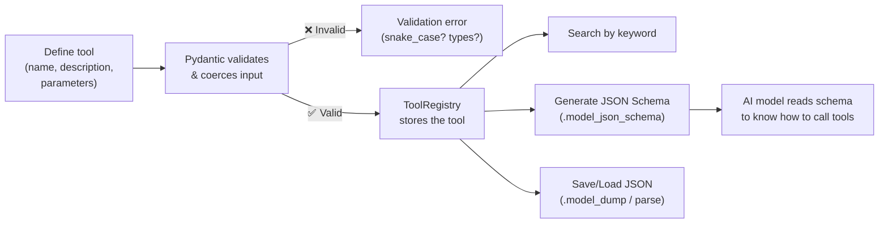
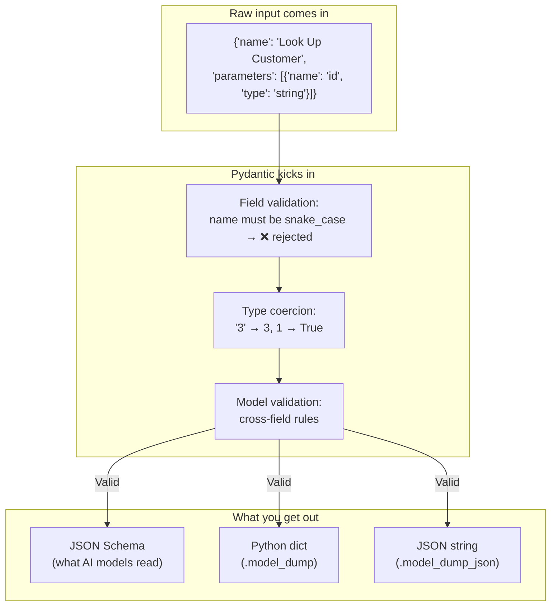

# Pydantic Toolkit

A tool registry that lets you define, validate, store, and search AI agent tool definitions using Pydantic models — and generate JSON Schemas from them.

## What does this do?

When an AI agent needs to call a tool (like looking up a customer or creating a ticket), it needs to know what the tool expects — what arguments, what types, what's required. This project builds a small system that manages those tool definitions: you can add tools, validate them, save/load from JSON, search by keyword, and generate the JSON Schema that an AI model would read.

## How it works



### What's actually happening under the hood



## What I learned building this

- **Pydantic BaseModel vs dataclass** — dataclasses give you convenience methods but no runtime validation. Pydantic actually enforces types, coerces where possible, and rejects bad data.
- **Validators** — `@field_validator` for single-field rules (like enforcing snake_case names), `@model_validator` for cross-field logic.
- **Coercion** — Pydantic tries to convert compatible types (`"3"` → `3`, `1` → `True`) instead of crashing.
- **JSON Schema generation** — `.model_json_schema()` turns a Pydantic model into a standard JSON Schema. This is how agent frameworks tell AI models what tools are available.
- **Serialization** — `.model_dump()` for Python dicts, `.model_dump_json()` for JSON strings. Makes saving/loading data trivial.

## Dataclasses vs Pydantic — when to use which

|  | Dataclass | Pydantic BaseModel |
|---|---|---|
| **Runtime validation** | ❌ None — wrong types pass silently | ✅ Validates every field on creation |
| **Type coercion** | ❌ You get what you pass in | ✅ `"3"` → `3`, `1` → `True` automatically |
| **Custom validators** | Manual `__post_init__` | `@field_validator`, `@model_validator` — declarative |
| **JSON Schema** | ❌ Not built in | ✅ `.model_json_schema()` — one line |
| **Serialization** | Manual or `asdict()` (shallow) | `.model_dump()`, `.model_dump_json()` — handles nesting |
| **Performance** | Faster (less overhead) | Slower (validation has a cost) |
| **Dependencies** | Standard library — zero | Requires `pip install pydantic` |

**Pick dataclass when:** your data is internal, you trust the source, and you want zero dependencies — config objects, internal DTOs, simple structs.

**Pick Pydantic when:** data crosses a boundary you don't control — user input, API responses, AI model output. Anywhere the shape of the data isn't guaranteed.

In agent systems, data almost always crosses trust boundaries (an AI model returned this JSON — is it actually valid?), which is why Pydantic shows up in nearly every agent framework.

## What this solves

- **Unvalidated tool definitions break agents silently.** Without validation, a tool with a missing parameter or a wrong type doesn't fail until the AI model tries to call it — and then the error message is useless. Pydantic catches these at definition time.
- **AI models need to know tool shapes.** The JSON Schema that Pydantic generates is exactly the format that AI models (Claude, GPT, etc.) read to understand what tools are available and what arguments they accept. Without this, you'd write schemas by hand and keep them in sync with your code manually.
- **Serialization for free.** Saving tool registries to disk, sending them over APIs, loading them back — all handled by `.model_dump()` and `.model_validate()`.

## What this can't do

- **Validates structure, not meaning.** Pydantic can enforce that a tool's `description` is a non-empty string, but it can't tell you if the description is actually useful for an AI model. A description like `"does stuff"` passes validation but is useless.
- **No runtime behavior.** This project defines and validates tool *definitions* — it doesn't execute tools, manage tool calls, or handle the agent loop. That's what agent frameworks (PydanticAI, LangChain) add on top.
- **No schema evolution.** If you change a tool's parameters, old saved JSON files won't automatically migrate. You'd need versioning or migration logic on top.

## When to use this pattern

- Building a custom agent framework or tool system from scratch
- Any project where external data (API responses, AI output, user input) needs to be validated before use
- When you need to generate JSON Schema for AI tool interfaces, MCP server definitions, or API documentation
- Configuration management where invalid config should fail loudly, not silently

## Key takeaways

1. **Pydantic is the TypeScript of Python at runtime** — type hints alone are just documentation, Pydantic actually enforces them. This is why it's the validation layer under almost every AI/agent framework.
2. **JSON Schema is the glue between AI models and tools** — when an AI model needs to call a tool, it reads a JSON Schema to know what arguments to pass. Pydantic generates this schema from your model definitions automatically. This same mechanism powers MCP tool definitions.
3. **Validate at the boundary, trust internally** — once data passes through Pydantic validation, you can trust it downstream. The cost of validation is paid once; the cost of unvalidated data is paid every time something breaks.

## How to run

```bash
python -m venv .venv
.venv\Scripts\activate      # Windows
pip install -r requirements.txt
python registry.py
```

## How to test

```bash
pytest -v
```

## Project structure

```
├── models.py          # Pydantic models — Tool and ToolParameter
├── registry.py        # ToolRegistry — add, remove, search, save, load
├── tests/
│   └── test_models.py # Validation and coercion tests
├── tools.json         # Sample saved tools (generated by registry.py)
├── requirements.txt
└── README.md
```