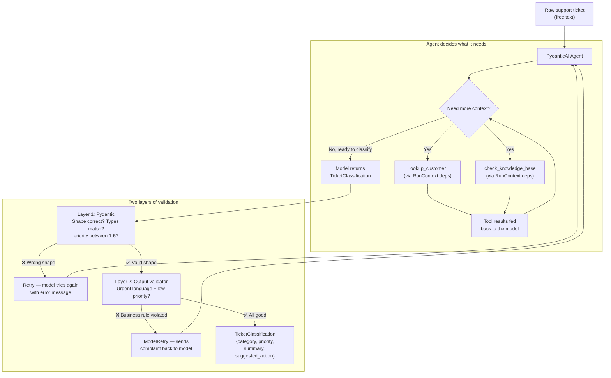
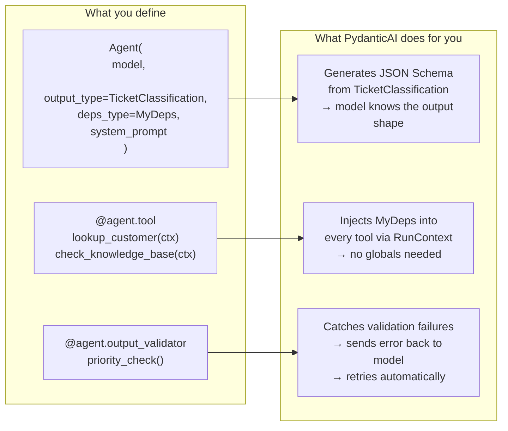

# Ticket Classifier

A PydanticAI agent that reads a free-text customer support ticket, looks up the customer and any relevant help articles, and returns a validated classification — category, priority, summary, and suggested action.

## What does this do?

Support tickets arrive as unstructured text. This agent turns them into structured data an app can actually route on. Given a ticket, it pulls the account ID out of the text and calls `lookup_customer` to find the customer's plan, calls `check_knowledge_base` to find related help articles, then classifies the ticket into a `TicketClassification` model. Because the output type is a Pydantic model, the agent can't return prose — it either returns data in the right shape or retries until it does.

There's also a business rule Pydantic can't express: if the ticket contains urgent language ("down", "outage", "data loss"), a priority below 3 is rejected and the model is asked to try again.

## How it works



### How PydanticAI wires everything together



## What I learned building this

- **Structured output with `output_type`** — handing an Agent a Pydantic model makes PydanticAI generate a tool schema from it and validate the model's reply against it. You get typed data back, not a string you have to parse.
- **Dependency injection with `deps_type`** — `MyDeps` carries the customer table, the knowledge base, and the raw ticket text into every tool and validator through `RunContext`. No globals, and tests can pass their own data in.
- **Tools** — `@agent.tool` functions let the model fetch data partway through a run. It decides when to call them from the function signature, so the ticket's account ID drives the lookup.
- **Output validators and `ModelRetry`** — `@agent.output_validator` runs after Pydantic validation, for rules about *meaning* rather than shape. Raising `ModelRetry` sends the model back for another attempt with the complaint attached.
- **Schema constraints beat field validators** — `Field(ge=1, le=5)` becomes part of the JSON Schema the model actually reads, so it gets the range right up front. A `@field_validator` is invisible to the model and only complains afterwards. This one bit me: with a bare `int`, the test model generated `priority=0` and every run burned its retries.
- **Testing an agent without an LLM** — `agent.override(model=TestModel())` swaps in a stub that fabricates output from the schema, and `models.ALLOW_MODEL_REQUESTS = False` makes sure a real API call can never sneak through. `TestModel` is deterministic, so to exercise a specific validator path you pin the output with `custom_output_args` rather than hoping it guesses a useful value.

## What this solves

- **Unstructured → structured, reliably.** Without structured output, you'd parse free-text LLM responses with regex or string matching and pray the format doesn't drift. With `output_type`, the framework enforces the shape and retries on failure. The output is always a valid `TicketClassification` or the run explicitly fails — no silent corruption.
- **Tools let the agent gather context on its own.** The agent decides *when* to call `lookup_customer` or `check_knowledge_base` based on what it sees in the ticket. You don't hardcode the order — the model figures out what it needs. This is the core difference between an agent and a script.
- **Dependency injection makes testing real.** Because tools receive data through `RunContext` instead of importing globals, you can swap in mock data for tests without patching anything. Same agent code, different deps.
- **Business rules on top of structural validation.** Pydantic handles "is this an int between 1 and 5?" Output validators handle "is it reasonable to mark a data-loss ticket as low priority?" Two layers, two concerns, cleanly separated.

## What this can't do

- **No memory across runs.** Each `agent.run()` call is stateless. If a user follows up with "actually, make that priority 1," the agent has no idea what "that" refers to. Multi-turn conversations need explicit message history management.
- **No branching or conditional workflows.** The agent loop is linear: think → call tools → think → respond. If you need "classify first, then route to different handling paths based on category," you'd have to orchestrate that yourself outside the agent. This is what LangGraph solves.
- **No human-in-the-loop.** The agent runs to completion. There's no built-in way to pause midway, show the human what it's about to do, wait for approval, and resume. For workflows that need human oversight before taking action, you need a state machine on top.
- **Retry is not infinite.** If the model keeps producing invalid output, the agent gives up after a set number of retries. For adversarial or ambiguous inputs, you need fallback logic beyond "try again."

## When to use this pattern

**Good fit:**
- Turning unstructured input into structured data (classification, extraction, parsing)
- Single-purpose agents with a clear input → output contract
- Projects where type safety and testability matter more than flexibility
- Prototyping agents quickly — PydanticAI has less boilerplate than LangChain for focused tasks

**Not the right tool when:**
- You need multi-step workflows with branching, loops, or human approval → use LangGraph
- You need a large ecosystem of pre-built integrations (vector stores, retrievers, memory backends) → LangChain has more out of the box
- You need agents coordinating with other agents in a structured way → look at orchestration frameworks

## Key takeaways

1. **Structured output is the difference between a demo and a product.** If you can't guarantee the shape of your agent's response, you can't build reliable downstream systems on top of it. `output_type` + Pydantic makes that guarantee.
2. **Schema constraints > field validators for LLM output.** `Field(ge=1, le=5)` shows up in the JSON Schema the model reads, so it gets it right the first time. A `@field_validator` only complains after the model already got it wrong. Guide the model, don't just reject its mistakes.
3. **Dependency injection isn't just clean code — it's what makes agents testable.** `RunContext` carrying deps into tools means you can test the full agent loop with mock data and `TestModel`, no API key needed, fully deterministic.

## How to run

```bash
python -m venv .venv
.venv\Scripts\activate      # Windows
pip install -r requirements.txt
```

The agent runs on Gemini, so add a `.env` with your key:

```
GOOGLE_API_KEY=your-key-here
```

Then classify the sample tickets:

```bash
python main.py
```

It sleeps 5 seconds between tickets to stay under the rate limit, and skips any ticket that returns an API error.

## How to test

```bash
pytest -v
```

The tests use `TestModel` throughout, so they need no API key and make no network calls.

## Project structure

```
├── models.py          # TicketClassification — the structured output model
├── agent.py           # Agent, deps, tools, and the priority output validator
├── main.py            # Runs the agent over the sample tickets
├── mock_data.py       # Fake customers, knowledge base, and sample tickets
├── conftest.py        # Empty — puts the project root on sys.path for tests
├── tests/
│   └── test_agent.py  # Agent tests using TestModel
├── requirements.txt
└── README.md
```