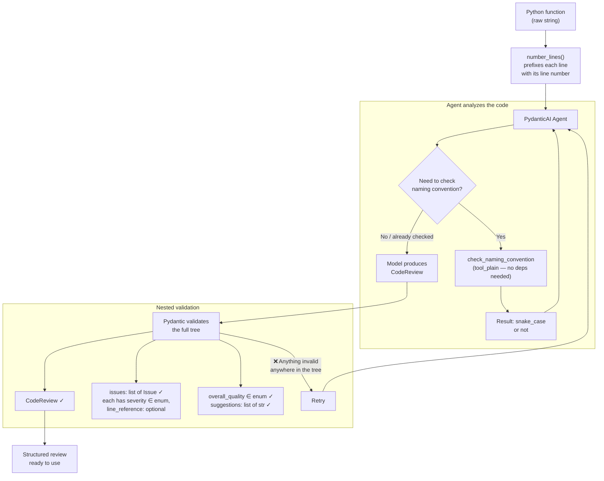
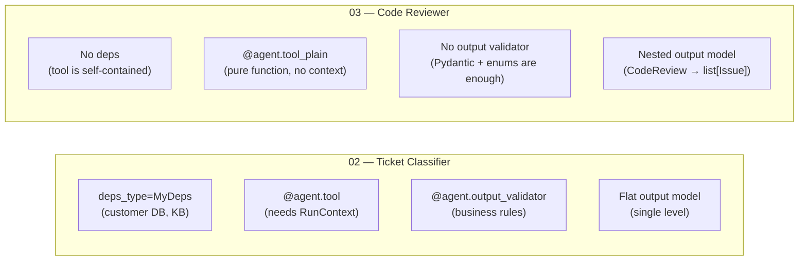

# Code Reviewer

A PydanticAI agent that reads the source of a Python function and returns a structured review — a list of issues with severities and line numbers, an overall quality rating, concrete suggestions, and a short summary.

## What does this do?

You hand the agent a Python function as a string. It checks for bugs, style problems, missing type hints, weak error handling, and readability issues, and calls a `check_naming_convention` tool to verify the function name is snake_case. The result is a `CodeReview` model, not prose:

- `issues` — each one an `Issue` with a `description`, a `severity` (`critical` / `warning` / `suggestion`), and an optional `line_reference`
- `overall_quality` — `good`, `needs_improvement`, or `poor`
- `suggestions` — actionable one-line improvements
- `summary` — one or two sentences

Before the code goes to the model, `number_lines` prefixes every line with its number, so the model can cite `"line 4"` instead of counting lines itself.

## How it works



### What's different from the Ticket Classifier

Both projects use PydanticAI, but they exercise different parts of the framework:



The ticket classifier needs external data (customer table, knowledge base) injected through deps. The code reviewer doesn't — the only tool is a pure function that checks naming. This shows that PydanticAI scales down cleanly: you don't carry framework weight you're not using.

## What I learned building this

- **Nested output models** — `CodeReview.issues` is a `list[Issue]`, and PydanticAI validates the whole tree. A single bad severity deep inside the list fails validation and triggers a retry, same as a bad top-level field.
- **`StrEnum` vs `Literal`** — both become an `enum` in the JSON Schema the model reads. `StrEnum` also gives the values a name in code (`Severity.CRITICAL`), which is handy for filtering issues or asserting in tests.
- **`tool_plain` for tools that don't need context** — `check_naming_convention` is a pure function of its input, so it takes no `RunContext` and the agent takes no deps. Because the decorator returns the original function, it can be unit tested directly.
- **Give the model data, don't make it count** — LLMs are bad at counting lines. Numbering them in the prompt makes `line_reference` reliable for free.
- **`defer_model_check=True`** — without it, creating the agent builds a Gemini client right away and fails when no API key is set, which breaks tests before `TestModel` can be swapped in. Deferring that check makes the tests truly key-free.
- **Tell the model it's allowed to find nothing** — without "don't invent problems" in the instructions, a reviewer will pad a clean function with nitpicks.

## What this solves

- **Structured code reviews you can act on programmatically.** The output isn't a wall of text — it's a list of issues with severities and line references. You can filter by `Severity.CRITICAL`, count warnings, sort by line number, or feed the results into a CI pipeline.
- **Nested validation handles complex output shapes.** Real-world agent outputs are rarely flat. A review has a list of issues, each issue has its own fields. Pydantic validates the entire tree in one pass — one bad enum value three levels deep triggers a retry just like a bad top-level field.
- **`tool_plain` keeps simple tools simple.** Not every tool needs access to deps or context. A pure function that checks naming conventions doesn't need `RunContext`, and `tool_plain` lets you write it as a regular function that's directly unit-testable.

## What this can't do

- **Can't actually run or lint the code.** The agent reads the source as text. It doesn't execute it, run a type checker, or invoke a linter. A real code review tool would combine LLM analysis with static analysis (pylint, mypy, ruff) for things LLMs reliably get wrong — like counting, scoping, or import resolution.
- **Line references are best-effort.** Numbering lines in the prompt makes references more reliable, but the model can still hallucinate line numbers for issues it invents. There's no verification step that checks whether "line 12" actually contains what the model claims.
- **No context beyond the single function.** The agent sees one function at a time. It can't reason about how the function fits into a larger codebase — whether it's called correctly, whether it duplicates existing logic, or whether the type it returns matches what the caller expects.
- **Same retry ceiling as any PydanticAI agent.** If the model keeps producing invalid nested structures (especially with complex output shapes), retries burn through and the run fails. More complex output models = more ways for validation to fail = more retries needed.

## When to use this pattern

**Good fit:**
- Turning unstructured analysis into structured, actionable data (reviews, audits, assessments)
- Any agent where the output has nested structure — lists of typed items, trees of decisions
- Tools that are pure functions with no external dependencies (`tool_plain`)
- Prototyping "LLM + validation" pipelines before adding static analysis or other tooling

**Not the right tool when:**
- You need the agent to actually execute code, run tests, or interact with a filesystem → you need a sandboxed execution environment, not just text analysis
- The review needs cross-file or codebase-wide context → you need retrieval (RAG) or a tool that reads multiple files
- You want to chain the review into an automated fix-and-verify loop → that's a multi-step workflow better suited to LangGraph

## Key takeaways

1. **Nested Pydantic models work seamlessly as agent output.** `list[Issue]` inside `CodeReview` validates the same way a flat model does — the framework handles the recursion. Don't flatten your output shapes just because an LLM is producing them.
2. **Prompt engineering is part of the architecture.** Numbering lines before sending code to the model isn't a hack — it's a design decision that makes `line_reference` usable. Similarly, telling the model "don't invent problems" prevents the padding behavior that makes reviews useless. These prompt choices are as important as the code.
3. **`tool` vs `tool_plain` is about dependency, not complexity.** If a tool needs deps or context from the run → `@agent.tool`. If it's a pure function of its arguments → `@agent.tool_plain`. The second one is directly testable without the agent, which makes your test suite simpler.

## How to run

```bash
python -m venv .venv
.venv\Scripts\activate      # Windows
pip install -r requirements.txt
```

The agent runs on Gemini, so add a `.env` with your key (`GEMINI_API_KEY` also works):

```
GOOGLE_API_KEY=your-key-here
```

Then review the three sample functions — one clean, one with bugs, one messy:

```bash
python main.py
```

It sleeps 5 seconds between samples to stay under the rate limit, and skips any sample that returns an API error.

## How to test

```bash
pytest -v
```

The tests use `TestModel` throughout, so they need no API key and make no network calls.

## Project structure

```
├── models.py          # CodeReview, Issue, Severity, Quality — the structured output
├── agent.py           # Agent, the check_naming_convention tool, and number_lines
├── main.py            # Runs the agent over the sample functions
├── mock_data.py       # Three sample functions: clean, has issues, messy
├── conftest.py        # Empty — puts the project root on sys.path for tests
├── tests/
│   └── test_agent.py  # Agent and tool tests using TestModel
├── requirements.txt
└── README.md
```