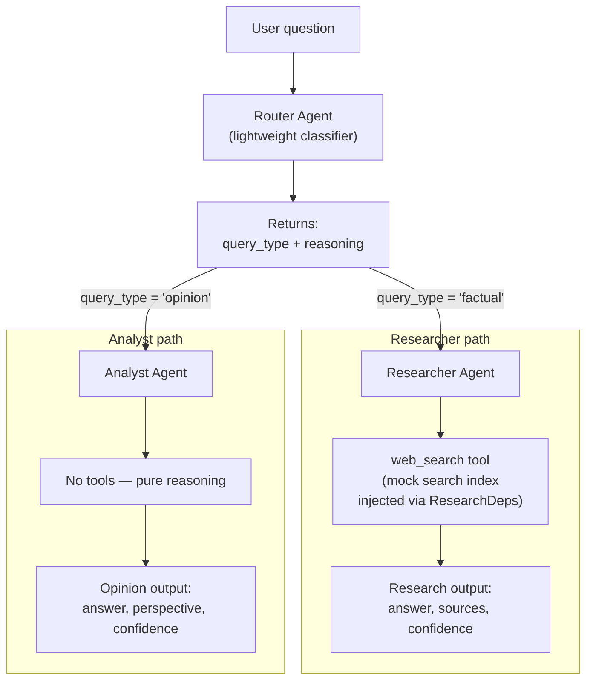
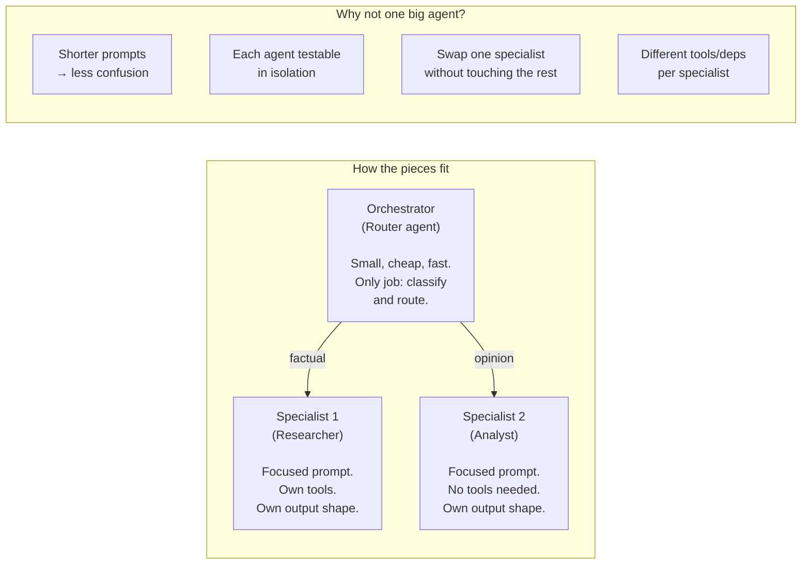
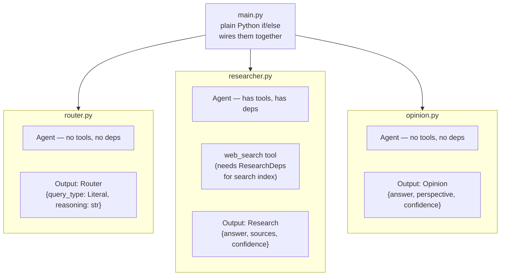

# Research Assistant

Three PydanticAI agents behind a router: a classifier decides whether a question is factual or opinion-based, then hands it to a researcher that searches for sources or to an analyst that reasons it out.

## What does this do?

One agent with one giant prompt has to be good at everything. This project splits the work instead. A small `Router` agent reads the question and returns a `query_type` of `"factual"` or `"opinion"` plus a one-line reason. `main.py` branches on that:

- **Factual** → the researcher agent, which calls a `web_search` tool over mocked search results, synthesises an answer, and returns it with the source URLs and a confidence level.
- **Opinion** → the analyst agent, which has no tools and returns an answer, the perspective it took (`balanced` / `pro` / `con`), and a confidence level.

Each branch has its own output model, so the shape of the result tells you which path ran — `Research` carries `sources`, `Opinion` carries `perspective`. The orchestration is plain Python control flow, not a framework graph.

## How it works



### The orchestrator-with-specialists pattern

This is the dominant pattern in production multi-agent systems. Think of it like a project manager delegating to specialists:



### What each agent owns



## What I learned building this

- **Routing beats one big prompt** — a cheap classification step lets each downstream agent have short, focused instructions. The researcher never has to be told what to do with an opinion question, because it never sees one.
- **`Literal` is a real constraint, not a hint** — `Literal["factual", "opinion"]` becomes an enum in the JSON Schema the model reads, so it can only answer with one of those two strings. That's what makes `if router_result.output.query_type == "factual"` safe to branch on without any string cleanup.
- **`Field(description=...)` is prompt text** — the description on `Router.reasoning` travels into the schema, so it's another place to tell the model what you want. Instructions aren't only in `instructions`.
- **Asking for reasoning alongside the label** — the `reasoning` field costs one extra sentence and makes a wrong classification obvious immediately, instead of leaving you guessing why the wrong agent ran.
- **Deps go only where they're needed** — the researcher takes `ResearchDeps` because its tool needs a search index it can be handed; the router and analyst take no deps at all. Uniformity for its own sake would just be noise.
- **Give a tool a fallback** — `web_search` matches keywords against the mock data and drops to the `"default"` entry when nothing hits, so the agent always gets a list back. A tool that returns nothing leaves the model to invent something.
- **One agent module, one concern** — `router.py`, `researcher.py`, and `opinion.py` each own an agent and its instructions; `main.py` only wires them together. Swapping a model or rewriting a prompt touches one file.
- **Failures shouldn't be fatal** — catching `ModelHTTPError` per question means a rate limit on question two doesn't cost you questions three and four.

## Single agent vs multi-agent — when to split

|  | One agent | Multiple specialists |
|---|---|---|
| **Prompt complexity** | One long prompt covering every case | Each agent gets a short, focused prompt |
| **Tool surface** | Every tool loaded for every request (even irrelevant ones) | Each specialist carries only the tools it needs |
| **Testing** | One big test suite, hard to isolate failures | Test each agent independently with its own inputs |
| **Error blast radius** | A bad prompt change affects everything | A bug in the researcher doesn't touch the analyst |
| **Latency** | One LLM call (possibly) | At least two: router + specialist |
| **Complexity** | Simpler to start with | Orchestration code to write and maintain |

**Split when:** the prompt is getting long and confused, different question types need different tools, or you want to test and iterate on one path without risking the others.

**Keep it single when:** the task is focused enough that one prompt handles it cleanly (like the ticket classifier or code reviewer).

## What this solves

- **Separation of concerns at the agent level.** Each agent has one job with its own prompt, tools, deps, and output model. The router doesn't know how research works. The researcher doesn't know what opinion questions look like. This makes each piece easier to understand, test, and change.
- **The output shape tells you what happened.** `Research` has `sources`. `Opinion` has `perspective`. You don't need a flag to know which path ran — the type system tells you. Downstream code can pattern-match on the output model.
- **Plain Python orchestration keeps it simple.** The routing logic is an `if/else` in `main.py`, not a framework graph. For two branches with no loops or human intervention, this is the right level of abstraction.

## What this can't do

- **No memory between questions.** Each question is independent. The router can't say "this is a follow-up to the last question" because it doesn't know what the last question was. Multi-turn conversations need message history threaded through.
- **Orchestration is manual and linear.** `main.py` routes to exactly one specialist per question. If you needed "run the researcher, then pass its output to the analyst for a second opinion," you'd wire that by hand. For more complex flows — loops, fan-out, conditional re-routing — you'd want a graph framework like LangGraph.
- **No state between agents.** The router's reasoning doesn't flow into the specialist's context unless you explicitly pass it. Each `agent.run()` starts fresh. In a graph-based system, shared state flows through every node automatically.
- **No human checkpoint.** The router classifies and the specialist runs — there's no pause where a human can review the classification before the specialist spends tokens. If the router misclassifies, you've already paid for the wrong agent's work.
- **The router is a single point of failure.** If it misclassifies a factual question as opinion, the analyst gives a reasoned answer without sources — plausible but ungrounded. There's no feedback loop to catch this.

## When to use this pattern

**Good fit:**
- Requests that fall into distinct categories needing different handling (support tiers, content types, language routing)
- When different paths need different tools, different output shapes, or different models (cheap model for routing, expensive model for analysis)
- Teams where different people own different specialists — each agent module is independently deployable

**Not the right tool when:**
- The workflow has loops, retries between agents, or human approval steps → LangGraph
- Agents need to negotiate or pass state back and forth → you need shared state, not isolated runs
- There are more than 3–4 branches → the if/else tree gets unwieldy; consider a framework-level router or a graph

## Key takeaways

1. **Route first, specialize second.** A cheap classifier up front means each downstream agent gets a focused job with a short prompt. This is almost always better than one agent that tries to handle every kind of input.
2. **Plain Python is a valid orchestration layer.** Not everything needs a framework graph. For a simple classify-then-delegate flow with no loops or shared state, `if/else` in `main.py` is the right abstraction. You'll know when you've outgrown it — the moment you want loops, persistence, or human checkpoints.
3. **Different output models per path is a feature, not a limitation.** `Research` has `sources`, `Opinion` has `perspective`. The type system carries the routing decision downstream without extra flags. Code that handles the result can trust the shape.

## How to run

```bash
python -m venv .venv
.venv\Scripts\activate      # Windows
pip install pydantic-ai python-dotenv
```

All three agents run on Gemini, so add a `.env` with your key:

```
GOOGLE_API_KEY=your-key-here
```

Then run the sample questions through the router:

```bash
python main.py
```

It prints the router's classification and then the output of whichever agent handled the question, both as JSON.

## Project structure

```
├── models.py          # Router, Research, Opinion — one output model per agent
├── router.py          # Classifier agent — factual or opinion
├── researcher.py      # Research agent, its deps, and the web_search tool
├── opinion.py         # Analyst agent — no tools, judgement only
├── main.py            # Routes each sample question to the right agent
├── mock_data.py       # Fake search results keyed by topic
└── README.md
```