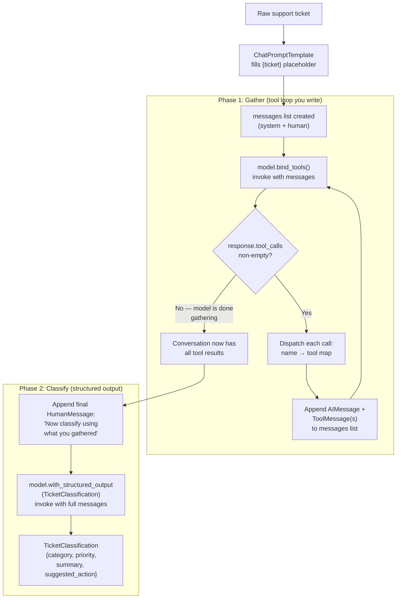
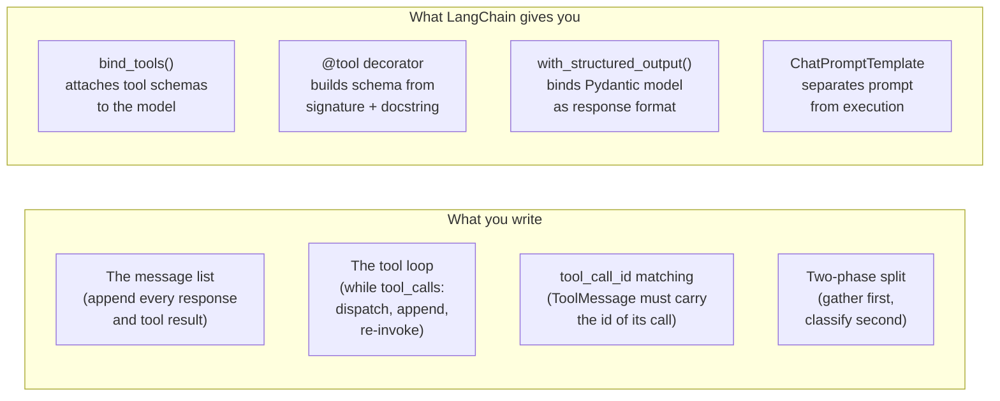
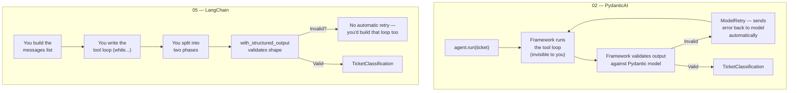

# LangChain Ticket Classifier

The same support-ticket classifier as [02](../02-ticket-classifier), rebuilt in LangChain instead of PydanticAI — to see what the framework was doing for me.

## What does this do?

Given a free-text support ticket, it pulls the account ID out of the text, calls `lookup_customer` for the customer's plan and history, calls `check_knowledge_base` for related help articles, and returns a validated `TicketClassification` — category, priority 1–5, one-line summary, and suggested action.

The run happens in two phases. First a **gather** phase: the model is bound to the tools and called in a loop — while it asks for tool calls, they're executed, their results appended as `ToolMessage`s, and the model is invoked again on the grown message list. Then a **classify** phase: the same conversation is handed to a second model configured with `with_structured_output(TicketClassification)`, and a final human turn telling it to classify using what it gathered.

Splitting it in two is the point. A model bound to tools wants to emit tool calls; a model pinned to a structured output wants to emit that one object. Asking for both at once fights itself, so the tools run first and the schema is applied to the finished conversation.

## How it works



### What you manage vs what the framework manages



## Same task, two frameworks — PydanticAI vs LangChain

This is the same ticket classifier as project 02, so the comparison is direct:



|  | PydanticAI (project 02) | LangChain (this project) |
|---|---|---|
| **Tool loop** | Handled by the framework — you never see it | You write the `while tool_calls` loop yourself |
| **Message management** | Framework manages the conversation internally | You own the messages list — append every response and tool result by hand |
| **Structured output** | `output_type` on the Agent — validates + retries | `with_structured_output()` — validates but no built-in retry on business rules |
| **Business rule validation** | `@agent.output_validator` + `ModelRetry` — automatic retry with complaint | You'd write a retry loop around the classify call yourself |
| **Dependency injection** | `deps_type` + `RunContext` — typed, tested | Pass data through closures or module-level variables |
| **Tool definition** | `@agent.tool` / `@agent.tool_plain` | `@tool` — similar, reads signature + docstring |
| **Boilerplate** | Less — framework handles plumbing | More — every implicit step becomes explicit code |
| **Visibility** | Less — the loop is a black box | More — you see and control every message and dispatch |
| **Ecosystem** | Smaller, newer | Massive — more integrations, more community resources, more examples |

**The tradeoff in one sentence:** PydanticAI hides the plumbing so you focus on the agent logic; LangChain shows you every pipe so you can reroute them.

## What I learned building this

- **You own the message list** — in LangChain the conversation *is* the state, and it's yours to maintain. Every model response and every tool result gets appended in order by hand. Forget one and the model silently loses the thread.
- **The tool loop is code you write** — `bind_tools` only tells the model the tools exist. Checking `response.tool_calls`, dispatching each one through a name→tool map, and re-invoking until the model stops asking is a `while` loop you write yourself. PydanticAI ran that loop for me and I never saw it.
- **`tool_call_id` is the wiring** — a `ToolMessage` has to carry the id of the call it answers. That id is how the model matches a result to the request it made, which matters the moment it asks for two tools in one turn.
- **`@tool` reads the signature and docstring** — same idea as PydanticAI's `@agent.tool`: the type hints become the argument schema and the docstring tells the model when to reach for it. Writing "like C-1234" into the docstring is what gets the ID passed in the right format.
- **`with_structured_output` is the whole validation story** — it binds the Pydantic model as the model's response format and gives back typed data. There's no retry-on-invalid-output layer like PydanticAI's `ModelRetry`; if you want the model corrected on a rule Pydantic can't express, that's a loop you build.
- **`ChatPromptTemplate` separates the prompt from the run** — `{ticket}` stays a placeholder until `.invoke()` fills it and `.to_messages()` turns it into the list the model takes.
- **Same task, more surface area** — every piece PydanticAI handled implicitly is now a line I can see and change. That's the trade: more control, more to get wrong.

## What this solves

- **Full visibility into the agent loop.** You see every message, every tool dispatch, every re-invocation. When something goes wrong, you can print the message list and see exactly where the conversation went off track. No black box.
- **The two-phase split solves a real LLM problem.** Models struggle when asked to call tools *and* produce structured output simultaneously — they try to do both and do neither well. Splitting gather and classify into separate invocations gives each phase a clear job.
- **LangChain's ecosystem is massive.** If you need to swap in a different model provider, add a vector store retriever, connect to a specific database, or deploy to a managed platform, LangChain probably has an integration. PydanticAI is more focused but has far fewer connectors.
- **`ChatPromptTemplate` makes prompts reusable.** The prompt is a template with placeholders, not a string you format inline. You can version prompts, swap them, and test them independently from the agent logic.

## What this can't do

- **No automatic retry on business rules.** PydanticAI's `ModelRetry` sends the model back with a complaint when an output validator fails. LangChain's `with_structured_output` validates the shape but doesn't have a built-in "retry with feedback" mechanism for semantic rules. You'd wrap the classify phase in your own retry loop.
- **No built-in dependency injection.** Tools that need external data (customer DB, search index) access it through closures or module scope. There's no `RunContext` carrying typed deps — which means tests have to mock at the module level instead of passing test data in.
- **Message management is error-prone.** Forgetting to append a `ToolMessage`, or appending it with the wrong `tool_call_id`, silently breaks the conversation. The model doesn't error — it just produces worse output because its context is malformed.
- **Same single-run limitation as PydanticAI.** This is still a stateless classify-and-return flow. No memory across tickets, no multi-turn follow-ups, no workflow branching. LangGraph adds those.

## When to use which

**Pick PydanticAI when:**
- You want to build focused agents fast with minimal boilerplate
- Type safety and testability are priorities (deps injection, TestModel)
- You need business-rule validation with automatic retry
- The agent's job is well-scoped: input → tools → structured output

**Pick LangChain when:**
- You need integrations the ecosystem already has (specific model providers, vector stores, retrievers, memory backends)
- You want full control over the message flow and tool dispatch
- You're building toward LangGraph (LangChain's primitives are the building blocks for LangGraph's nodes)
- The team already knows LangChain — ecosystem momentum matters

**Neither is wrong.** They solve the same problem with different philosophies. PydanticAI optimizes for the common case. LangChain optimizes for the general case.

## Key takeaways

1. **Building the same thing twice in different frameworks is the fastest way to understand what each framework actually does.** The tool loop, message management, and retry logic that PydanticAI hid became code you wrote in LangChain. You can't appreciate what an abstraction gives you until you've done it without the abstraction.
2. **The two-phase pattern (gather then classify) is a general technique, not a LangChain thing.** Whenever a model needs to use tools *and* produce structured output, splitting those into separate invocations avoids the "do two things at once" problem. This applies regardless of framework.
3. **LangChain is the on-ramp to LangGraph.** The message types, tool binding, and invocation patterns you learned here are exactly what LangGraph nodes use. LangGraph doesn't replace LangChain — it orchestrates LangChain primitives into state machines with persistence, branching, and human-in-the-loop.

## How to run

```bash
python -m venv .venv
.venv\Scripts\activate      # Windows
pip install langchain-core langchain-google-genai python-dotenv pydantic
```

The model is Gemini, so add a `.env` with your key:

```
GOOGLE_API_KEY=your-key-here
```

Then classify the sample tickets:

```bash
python main.py
```

Each ticket prints its classification as JSON. Any ticket that raises — an API error, a rate limit — is reported and skipped so the rest still run.

## Project structure

```
├── models.py          # TicketClassification — the structured output model
├── tools.py           # lookup_customer and check_knowledge_base, as @tool functions
├── agent.py           # Prompt, bound model, the tool loop, and the structured-output call
├── main.py            # Runs the classifier over the sample tickets
├── mock_data.py       # Fake customers, knowledge base, and sample tickets
├── requirements.txt
└── README.md
```