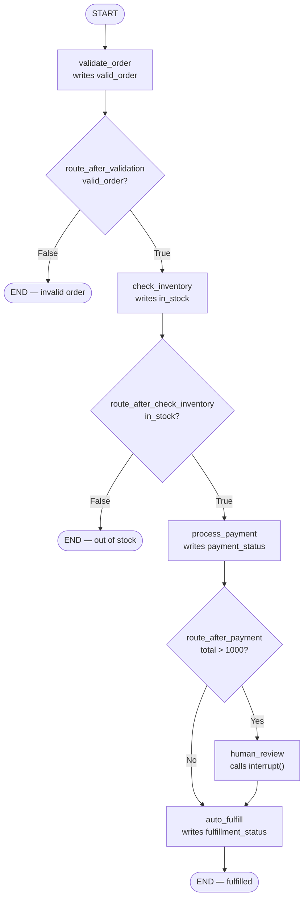
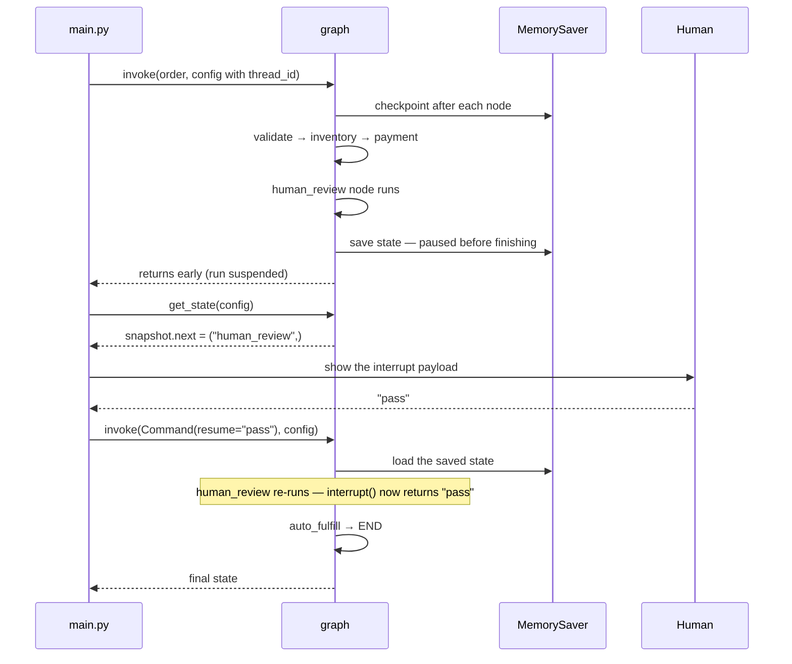
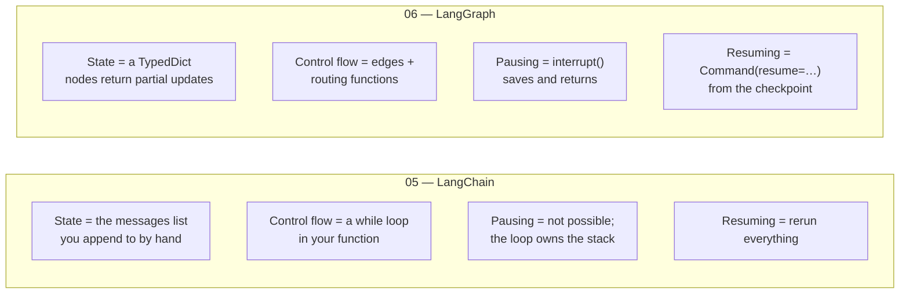

# Order Processor

An order pipeline built as a LangGraph state machine — validate, check stock, take payment, and either auto-fulfill or pause mid-run and wait for a human to approve.

## What does this do?

An order comes in as a dict — `order_id`, `customer_name`, `items`, `total` — and becomes the starting `OrderState`. Five nodes run over that state, each writing back one field:

- **`validate_order`** — has a name, has items, total above zero → `valid_order`
- **`check_inventory`** — every item present in `INVENTORY` with a non-zero count → `in_stock`
- **`process_payment`** — mocked, always succeeds → `payment_status`
- **`human_review`** — calls `interrupt()`, which **stops the graph mid-run** and returns control to the caller → `human_review_status`
- **`auto_fulfill`** — marks it done → `fulfillment_status`

Between them sit three routing functions that read the state and return the name of the next node, or `END` to stop. An invalid order never reaches inventory. An out-of-stock order never reaches payment. An order over $1000 detours through human review before fulfillment; anything under goes straight there.

There's no LLM in this project. That's deliberate — the point is the graph machinery itself: state, conditional edges, checkpointing, and interrupts, with the reasoning parts mocked out so nothing hides behind a model call.

## How it works



### The interrupt: how a graph pauses and resumes

This is the part that doesn't exist in projects 01–05. `interrupt()` doesn't block a thread — it **throws**, the checkpointer saves the state as it stood, and `graph.invoke()` returns early. The process can exit entirely; the run is sitting in the checkpointer under its `thread_id`, waiting.



Two details worth holding onto:

- **`thread_id` is the identity of a run.** Here it's the order ID, so every order gets its own independent conversation with the graph. Resume with a different `thread_id` and you're resuming a different order — or nothing at all.
- **The interrupted node re-runs from the top on resume.** `interrupt()` returns the resumed value the second time through instead of throwing. Anything above the `interrupt()` call in that node executes twice, so side effects belong in a node of their own.

## LangChain (05) vs LangGraph (06)

Project 05 was a `while` loop over a message list. This is the same family of problem — multi-step work with branching — expressed as a graph instead:



|  | LangChain (project 05) | LangGraph (this project) |
|---|---|---|
| **State** | The message list — you append every turn yourself | A `TypedDict`; each node returns a dict of fields to merge |
| **Control flow** | A `while` loop you write | Edges and conditional edges the runtime walks |
| **Branching** | `if` statements inside the loop | Routing functions returning a node name or `END` |
| **Persistence** | None — state lives in a local variable | Checkpointer saves after every node, keyed by `thread_id` |
| **Human-in-the-loop** | Not really possible mid-run | `interrupt()` + `Command(resume=…)` |
| **Visibility** | Print the message list | `get_state()`, `get_graph().draw_mermaid()`, full checkpoint history |
| **Cost of a step** | A function call | A node, an edge, and a checkpoint write |

**The tradeoff in one sentence:** a loop is cheaper until you need to stop halfway and come back, and then it's the wrong shape entirely.

## What I learned building this

- **Nodes return partial updates, not the whole state.** `validate_order` returns `{"valid_order": True}` and LangGraph merges it. You never rebuild the state dict, and two nodes writing different fields don't clobber each other.
- **Routing functions are separate from nodes for a reason.** A node's job is to *change* state; a router's job is to *read* it and name the next step. Keeping them apart is what makes the graph drawable — `graph.get_graph().draw_mermaid()` prints the whole diagram because the structure is declared, not buried in `if` statements.
- **`END` is a real destination.** Returning `END` from a router stops that branch cleanly. Orders 003 and 004 never touch payment, and the state they finish with just has `None` in the fields those nodes would have filled.
- **The checkpointer is what makes interrupts possible.** `compile(checkpointer=...)` isn't optional decoration — without saved state there's nothing to resume into. `MemorySaver` keeps it in RAM, which means restarting the process loses every paused order; swapping in a SQLite or Postgres checkpointer is the production version of the same interface.
- **`snapshot.next` is how you detect a pause.** After `invoke()` returns, a non-empty `snapshot.next` means a node is still waiting. That's the difference between "finished" and "suspended", and the return value alone doesn't tell you which.
- **The interrupt payload is a message to whoever's deciding.** Whatever dict you pass to `interrupt()` comes back out through `snapshot.tasks[0].interrupts[0].value` — order ID, total, items, customer. It's the review screen's data, defined at the point the pause happens.
- **`Command(resume=value)` is the input to the second half of the run.** The value lands as `interrupt()`'s return value. Here `"pass"` becomes `human_review_status`, and a `"fail"` would flow the same way.

## What this solves

- **Human-in-the-loop that survives the process exiting.** An order over $1000 stops and waits. The approval can arrive seconds later or the next morning, from a web form or a Slack button, and the graph picks up exactly where it stopped. Nothing is held open waiting.
- **The flow is a diagram, not prose.** Because edges are declared, the graph can draw itself. When the rule changes from $1000 to $500, you change one router — and the picture updates to match, which a `while` loop full of `if`s never does.
- **Every step is checkpointed.** You can ask an order where it got to and what each node decided. Debugging becomes reading state rather than re-running with print statements.
- **Branch dead-ends are explicit.** Invalid and out-of-stock orders stop at a named edge to `END` instead of falling through the rest of a function guarded by flags.

## What this can't do

- **`MemorySaver` doesn't survive a restart.** Paused orders live in process memory. Real deployments need `SqliteSaver` or `PostgresSaver` — same API, durable storage.
- **`check_inventory` will `KeyError` on an unknown item.** `INVENTORY[item]` assumes the item exists. An order for something not in the catalogue crashes the node instead of failing validation.
- **Payment is a stub that always succeeds.** There's no failure branch, no retry, and no compensating action to unwind a charge when a later step fails — which is the hard part of a real order pipeline.
- **Only `"pass"` is exercised on resume.** `main.py` always resumes with `"pass"`, and nothing routes on `human_review_status` afterwards — a rejected order would still reach `auto_fulfill`. The router that reads the human's decision is the obvious next node to add.
- **No parallelism.** Every node runs one after another. LangGraph supports fan-out to concurrent branches with reducers to merge their writes; this graph is a single path.

## Key takeaways

1. **Persistence is the feature, not the plumbing.** Nodes and edges are a tidy way to write a pipeline, but a checkpointer is what makes pausing, resuming, retrying, and inspecting possible at all. That's the thing plain Python control flow can't give you at any price.
2. **`interrupt()` inverts who's in control.** The graph no longer has to finish in one call. It can hand a decision out to a person and stop existing until they answer — the shape almost every real approval workflow actually needs.
3. **Declared structure beats implicit structure.** Once routing lives in functions attached to edges, the runtime knows the shape of your program: it can draw it, checkpoint it, replay it, and resume it. Written as an `if`/`while` tangle, that same logic is opaque to everything but the interpreter.

## How to run

```bash
python -m venv .venv
.venv\Scripts\activate      # Windows
pip install -r requirements.txt
```

No API key needed — there's no model call anywhere in this project.

```bash
python main.py
```

Each of the four sample orders runs on its own `thread_id`. Watch for:

- **ORD-001** ($1200) — pauses, prints the interrupt payload, resumes with `"pass"`, fulfills
- **ORD-002** ($80) — straight through to auto-fulfill
- **ORD-003** (headphones, stock 0) — stops after inventory
- **ORD-004** (no customer name) — stops after validation

Each run also prints the graph's own Mermaid diagram via `graph.get_graph().draw_mermaid()`.

## Project structure

```
├── graph.py           # OrderState, the five nodes, the routing functions, and the compiled graph
├── main.py            # Runs the sample orders, handles the pause, resumes with a decision
├── mock_data.py       # INVENTORY and the four sample orders
├── requirements.txt
└── README.md
```
