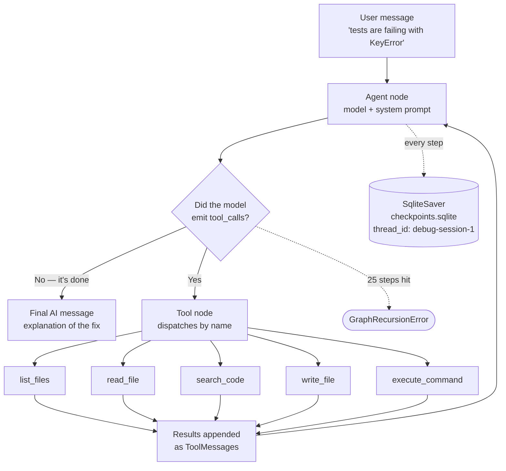
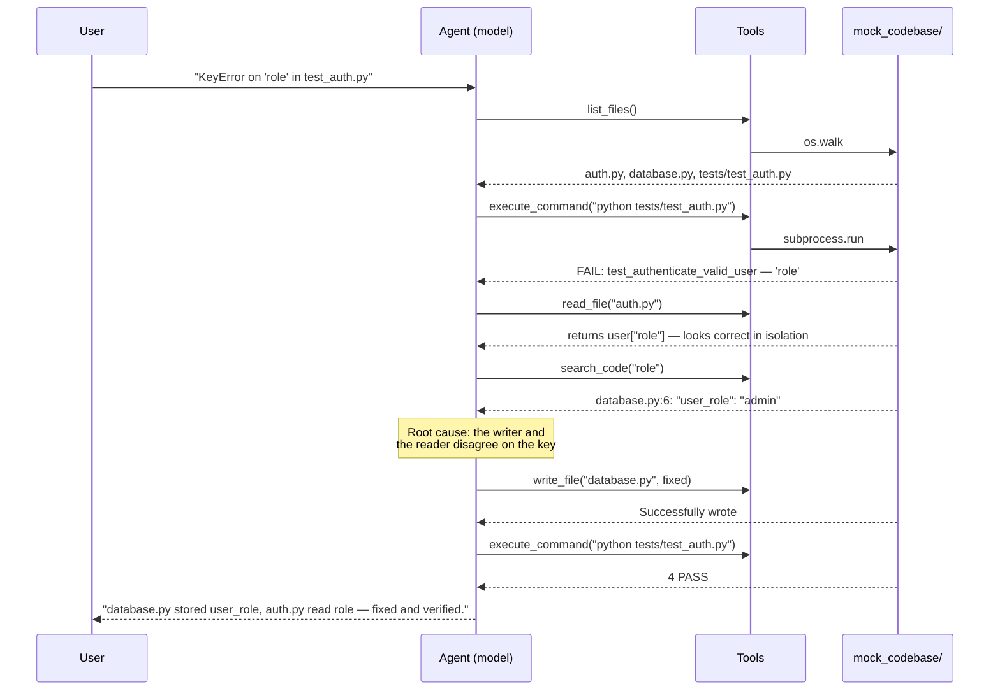
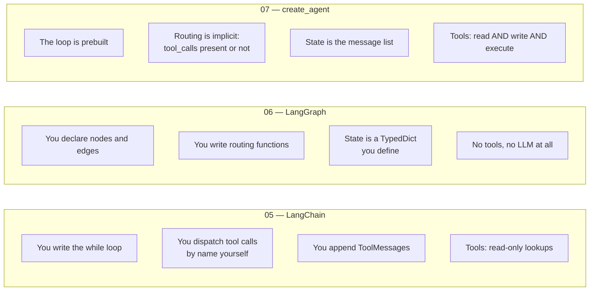

# Debug Agent

An autonomous debugging agent: give it a bug report in plain English and it reads the codebase, runs the failing tests, traces the root cause, writes the fix, and re-runs the tests to prove it worked.

## What does this do?

`main.py` hands the agent one sentence — *"The tests in tests/test_auth.py are failing with a KeyError on 'role'. Can you investigate and fix the bug?"* — and then gets out of the way. Everything after that is the model deciding what to do next.

It has five tools, all scoped to a sandbox directory (`mock_codebase/`):

- **`list_files`** — walk the project tree, skipping `__pycache__` and friends
- **`read_file`** — read one file by relative path
- **`search_code`** — grep a keyword across every `.py`, returning `file:line: content`
- **`write_file`** — overwrite a file with new contents
- **`execute_command`** — run a shell command in the project dir, returning stdout **and** stderr

That last pair is what makes this different from every project before it. Projects 01–06 could *look things up*. This one **changes files on disk and runs code**. The agent isn't producing an answer for a human to act on — it's doing the acting.

There is no graph to draw here and no routing functions to write. `create_agent()` builds the reason-act loop for you; the entire agent is a model, a list of tools, a system prompt, and a checkpointer. The system prompt is where most of the tuning went — a six-step procedure, and a short list of rules whose only job is to stop the model re-reading things it has already read.

## The bug it's given

The seeded bug is a field-name mismatch across a module boundary:

```python
# database.py — stores the field as "user_role"
{"email": "alice@example.com", "name": "Alice", "password": "secret123", "user_role": "admin"}

# auth.py — reads it as "role"
return {"email": user["email"], "name": user["name"], "role": user["role"]}  # KeyError
```

It's a deliberately *two-file* bug. The error surfaces in `tests/test_auth.py`, is raised in `auth.py`, and is actually caused by `database.py`. An agent that only reads the file named in the bug report finds nothing wrong with it — the fix requires following the data backwards to where it's written.

## How it works



### A run, step by step

The path below isn't scripted anywhere — it's the model choosing each tool from what the last one returned.



The verification step is the whole point. The agent doesn't *claim* the fix works — it runs the tests and reads the output, and if they still fail, that failure becomes the next observation and the loop keeps going.

## `create_agent` vs the loops in 05 and 06



|  | 05 — LangChain | 06 — LangGraph | 07 — this project |
|---|---|---|---|
| **Who writes the loop** | You (`while response.tool_calls`) | You (nodes + edges) | `create_agent()` |
| **Routing** | `if` statements | Conditional-edge functions | Implicit — tool calls or not |
| **State** | A list you append to | A `TypedDict` you define | The message list, managed |
| **Steps** | However long your loop runs | The graph's fixed shape | Open-ended, capped by `recursion_limit` |
| **Persistence** | None | `MemorySaver` + `thread_id` | `SqliteSaver` — survives restarts |
| **Tool reach** | Fake lookups in a dict | No tools | Real filesystem + subprocess |
| **Failure mode** | Wrong classification | Wrong branch taken | **Wrong file written to disk** |

**The shape of the progression:** 05 taught what the loop is by making you write it. 06 taught what structure buys you — persistence, pausing, a drawable graph. 07 hands the loop back to the framework, because once tools can act on the world, the interesting question stops being *how do I sequence these calls* and becomes *how much do I let it do unsupervised*.

## What I learned building this

- **`create_agent` is the whole loop in one call.** Model, tools, system prompt, checkpointer — no nodes, no edges, no routers. The graph underneath is still a LangGraph graph (same `thread_id`, same checkpointing, same `invoke`), which is why the config dict from project 06 works unchanged here.
- **Tool docstrings are the agent's instructions for using them.** Each docstring says not just what the tool does but *when to reach for it* — "use this to trace where functions are defined", "use this to apply a bug fix after identifying the issue". The model reads those strings at decision time; a vague docstring is a vague agent.
- **`execute_command` returns stderr, deliberately.** A tool that swallowed stderr would hand the agent a silent success on a failing test run. Tracebacks are the single most useful thing a debugging agent can read, so they're captured and returned as part of the result.
- **`recursion_limit` is the stop button.** The loop has no natural end — the model keeps going until it stops asking for tools. 25 steps is roughly 10–12 tool calls: enough for this bug, and a hard ceiling for when the prompt's anti-thrashing rules don't hold.
- **`SqliteSaver.from_conn_string()` is a context manager, not a constructor.** It yields a saver and *closes the connection* when the `with` block exits, which makes it wrong for a module-level checkpointer — the saver would be dead by the time the agent used it. `SqliteSaver(sqlite3.connect(path, check_same_thread=False))` is the form that outlives the import.
- **`BASE_PATH` is the sandbox.** Every tool joins its path onto `mock_codebase/`, so the agent's blast radius is one directory. That's the only thing standing between "fixes a test" and "rewrites your project" — worth noticing how little code it is.
- **`dirs[:] = [...]` is load-bearing.** Assigning to the slice mutates the list `os.walk` is holding, which is how you prune directories mid-walk. `dirs = [...]` would rebind a local name and walk `__pycache__` anyway.
- **The system prompt sets the *method*, not the answer.** It lays out six steps — list the files, run the tests to see the real error, read only what the traceback points at, stop investigating once the root cause is clear, write the fix, verify once — and says nothing about what the bug is or which file it's in. Without a procedure, models tend to guess at a fix from the bug report alone and write it without ever running the test.
- **The expensive failure mode isn't a wrong fix, it's thrashing.** Left to itself the model re-reads files it has already read and re-greps keys it has already found, spending steps re-confirming what's sitting in its own context. That's what the `## Rules` half of the prompt is for: never re-read a file, never search for something a file already told you, fix as soon as you can name the bug, one verification run. Rules in a prompt are advisory — `recursion_limit` is the only thing that actually stops the loop — but they're the difference between finishing in ~6 tool calls and grinding into the ceiling.
- **"Be specific" has to be asked for.** The last rule makes the final answer name the file, the line, the old value and the new value. Without it the closing message trends toward "I identified and resolved the issue", which is useless for the one thing you actually want from a transcript: checking whether the fix it made is the fix you'd have made.

## What this solves

- **The investigation is the work, and it's automated.** The gap between "a test is failing" and "here's why" is reading, grepping, and re-running — mechanical work that happens to need judgment at each step. That's exactly the shape a tool loop fits.
- **Cross-file bugs get traced, not guessed.** `search_code` lets the agent follow a key backwards from where it's read to where it's written, which is how the `user_role` / `role` mismatch actually gets found.
- **Fixes are verified, not asserted.** Because the agent can run the tests after writing, "fixed" means "the tests passed afterwards" rather than "the model sounded confident".
- **The full trail is in the transcript.** `main.py` prints every AI turn, every tool call with its arguments, and every tool result. You can read exactly which file it opened and what it saw before deciding — and the checkpointer keeps that history under the thread ID.

## What this can't do

- **`write_file` replaces the entire file.** There's no patch, no diff, no partial edit. The model has to reproduce every line it isn't changing, and a truncated or hallucinated rewrite silently destroys working code. There's no backup and no undo.
- **A plausible fix can be the wrong fix.** Changing `user["role"]` to `user.get("role")` makes the `KeyError` disappear and still returns `None` — the error moves from a crash to a silent wrong value, and a run that stopped there would report success. Verification catches this only because the tests assert on the value, not just on not-crashing.
- **`execute_command` runs arbitrary shell with `shell=True`.** The 30-second timeout is the only guard. The sandbox is a path prefix, not a real boundary — nothing stops a command from walking out of `cwd`. Fine for a mock codebase on a laptop; not a model for anything with real code in it.
- **The codebase is left modified after a run.** The agent edits `mock_codebase/` in place, so re-running the demo means restoring the original bug first. Worth a `git stash` or a copy before each run.
- **Persistent history cuts both ways.** `SqliteSaver` keeps every session in `checkpoints.sqlite`, so a fixed `thread_id` means re-running `main.py` *continues* the old conversation instead of starting fresh — the agent sees it already fixed the bug. Use a new `thread_id` per run when you want a clean slate, and the same one when you want to resume.
- **No human-in-the-loop.** Project 06 could pause before a consequential step and wait for approval; this agent writes files without asking. Combining the two — `interrupt()` before `write_file` — is the obvious next version.
- **`list_files` isn't decorated with `@tool`.** It works because `create_agent` coerces a plain callable with a docstring into a tool, but the inconsistency with the other four is accidental rather than intentional.

## Key takeaways

1. **Write access changes the risk profile entirely.** Every project up to here could be wrong in a way that wasted your time. This one can be wrong in a way that costs you code. The sandbox path, the timeout, and the recursion limit aren't polish — they're the parts that make running it sane.
2. **Verification closes the loop.** An agent that can check its own work turns a one-shot guess into an iteration: act, observe the result, correct. That feedback edge is what separates "an LLM that suggests a fix" from "an agent that fixes it".
3. **Prebuilt loops are the right default once tools are real.** Hand-writing the loop in 05 was worth doing once, for understanding. With five tools and an open-ended task, the loop is the least interesting part of the system — the tool design, the sandbox, and the stopping conditions are where the thinking goes.

## How to run

```bash
python -m venv .venv
.venv\Scripts\activate      # Windows
pip install langchain langchain-google-genai langgraph langgraph-checkpoint-sqlite python-dotenv
```

Create a `.env` with a Google AI Studio key:

```
GOOGLE_API_KEY=your-key-here
```

```bash
python main.py
```

The transcript prints every turn: AI reasoning, each `[AI → tool call]` with its arguments, and each `[Tool: name]` result. To watch it work from a clean slate, restore the original bug first — `database.py` should say `"user_role"` and `auth.py` should read `user["role"]`.

You can also run the failing tests yourself to see what the agent sees:

```bash
cd mock_codebase && python tests/test_auth.py
```

## Project structure

```
├── graph.py                    # The model, the tool list, the SqliteSaver, and create_agent()
├── tools.py                    # The five tools + BASE_PATH sandbox
├── main.py                     # Sends the bug report, prints the full transcript
├── mock_codebase/              # The sandbox the agent is allowed to touch
│   ├── auth.py                 # Reads user["role"] — where the error surfaces
│   ├── database.py             # Stores "user_role" — where the bug actually is
│   └── tests/test_auth.py      # The failing tests, runnable standalone
├── checkpoints.sqlite          # Created on first run; gitignored
├── .env                        # GOOGLE_API_KEY
└── README.md
```
